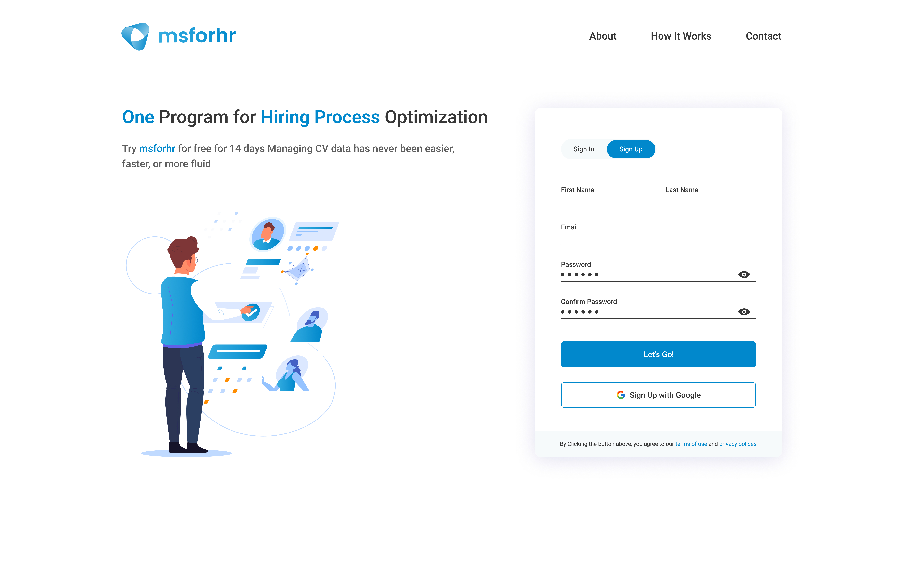
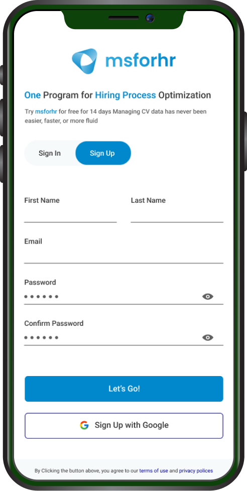

# whiteroof
Whiteroof(old msforhr) is CV management platform for HR teams.

HR teams can create company folder -> department folder -> copy link of the department folder.

Place that link on online job platform and then potential candidate can send their CV directly to that folder.

Registartion/Login page

Below is main page which is accessible only for the HR

Version for the candidates from where they can send resumes

Mobile version. The design is fully adaptive

